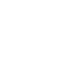

# Description

    <h3>
        <a href="https://www.youtube.com/c/TsodingDaily">Tsoding Daily's Youtube Channel</a></>
    </>
     

 
Hello everyone, and welcome to yet another VSCode theme.  

This theme is based on one of Tsoding's earliest color themes before it turned to the "dark side" (higher contrast and darker), its seen in Tsoding's ['Writing My Own Malloc in C'](https://www.youtube.com/watch?v=sZ8GJ1TiMdk&ab_channel=TsodingDaily) video! But a darker and custom light theme are also supplied as well.  
This theme has made special inclusions that utilize IDEs, syntax highlighting has been added to keywords and tokens that originally weren't possible with Tsoding's editor (i.e. a darker color for function local variables). 

If you're looking for Tsoding's current theme for VSCode take a look at [JoaoAJMAto's Tsoding Theme](https://marketplace.visualstudio.com/items?itemName=JoaoAJMAtos.tsoding-theme), it's great!

      <h1> Dark Theme </>
      
      <h1> Custom Darker Theme</>
      

Enjoy!

***Quick Tip**: If you're making your own theme, but don't know what the name of any of the tokens are input `Inspect Editor Tokens And Scopes` into the VSCode command palette, then click any token and find in depth information about it! (you without this: 😭).*
